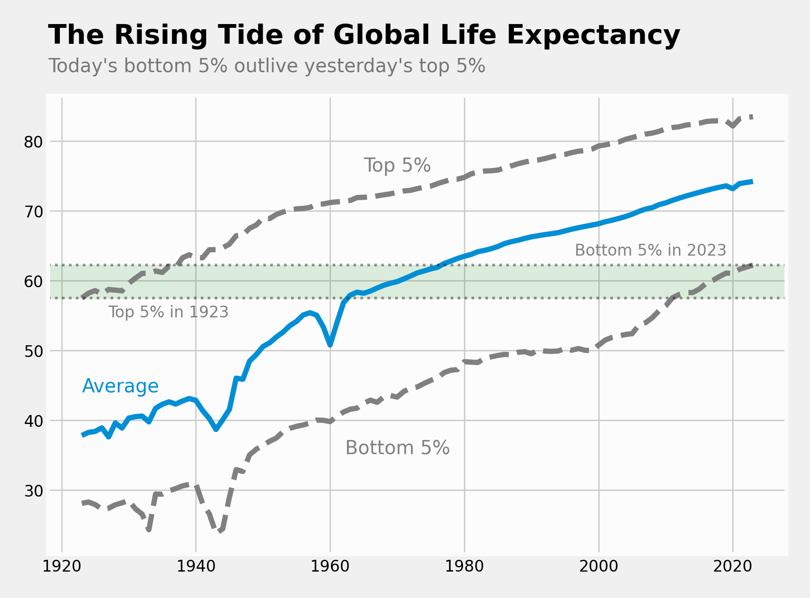
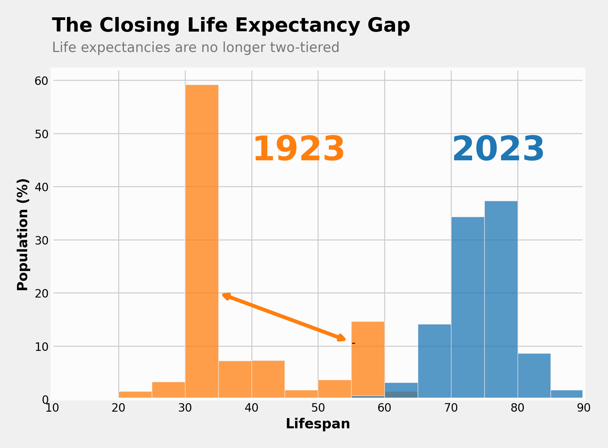
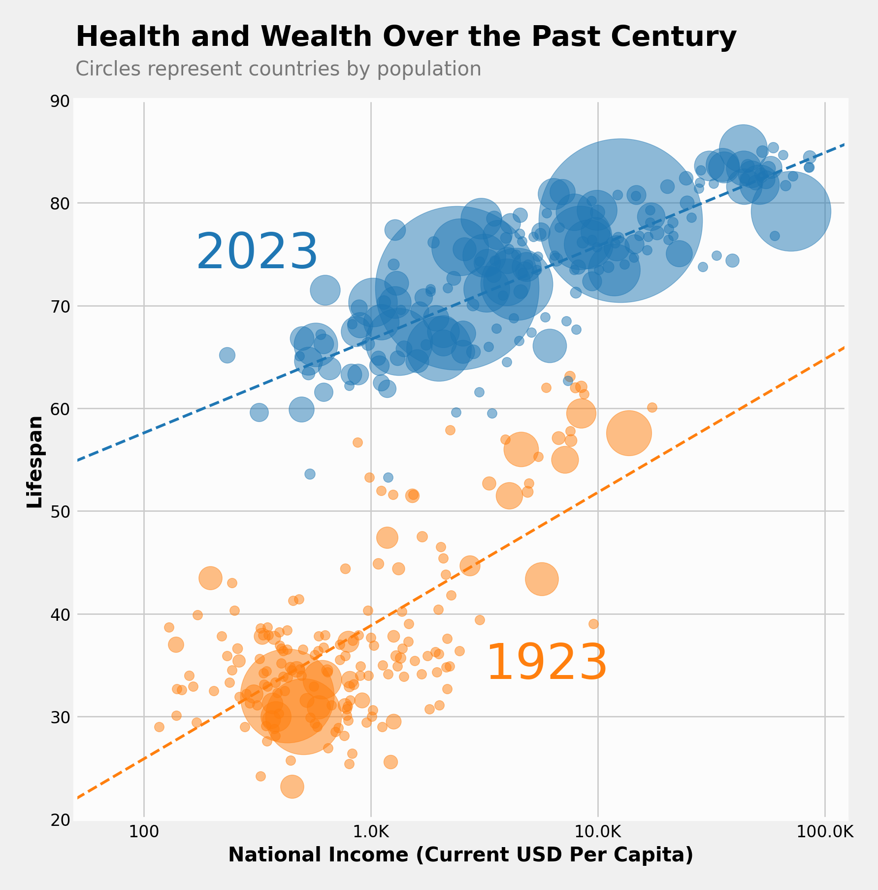
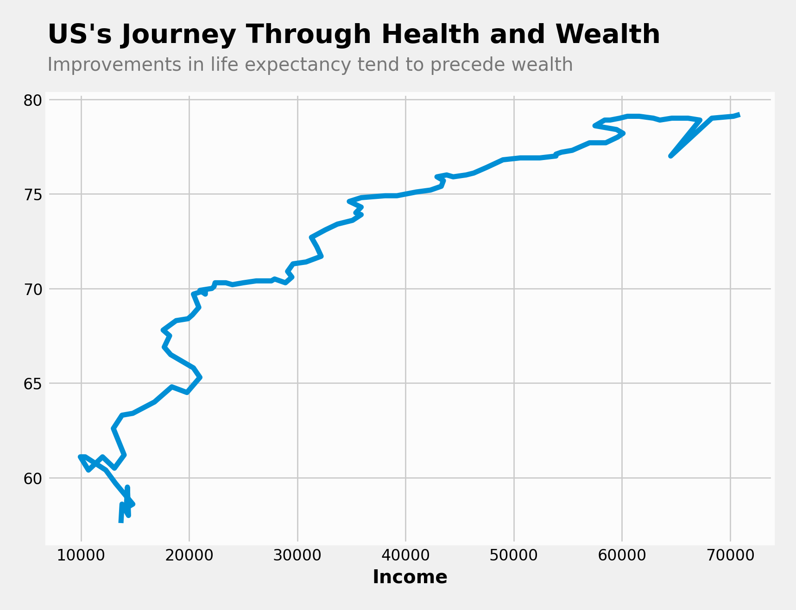
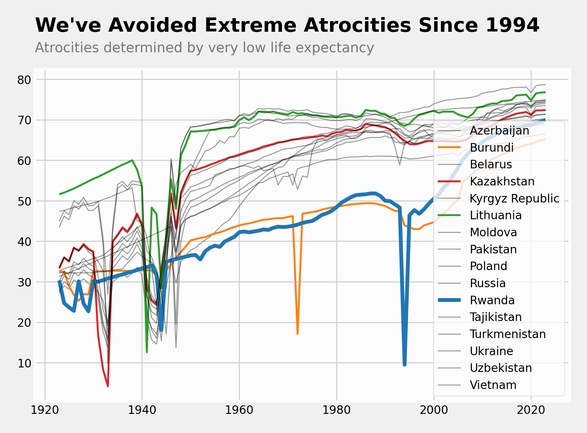

# Life Expectancy Visualizations
Inspired by the popular Hans Rosling TED Talk [The Best Stats You've Ever Seen](https://youtu.be/hVimVzgtD6w?si=TZL64gkgAxlJ1fqi), this project visualizes how the world has evolved in terms of life expectancy and wealth over the past century. 

While our daily news feeds may paint a bleak picture of the future, the historic data show that the arc of history bends towards progress long-term. This is especially true for life expectancies, which have improved steadily over the last century. This project explores creative ways to visualize our worldwide journey towards improved health and wealth over the past century.

## Project Setup
To run this project, simply run the `code/03-Visualizations.ipynb` notebook in Jupyter Labs. 

To see the project's final visualizations, navigate to the 'charts' folder.

Running this project requires an Anaconda installation or a Python installation with Pandas, Matplotlib, and Seaborn.

## Data

This project is based on global life expectancy, population, and wealth (GNI per capita normalized to current US dollars) data for 190 countries from 1923 to 2023. The data was obtained from Hans Rosling's [gapminder data](https://www.gapminder.org/data/).

This is a derived data source. The gapminder data is based on the much larger [World Development Indicators dataset](https://databank.worldbank.org/source/world-development-indicators#
) by the World Bank.

## Findings

### Life Expectancies have improved drastically

Global life expectancies have improved so drastically over the past century that there is almost no overlap between life expectancies now versus a century ago. In other words, today's lowest life expectancies exceed the highest life expectancies from a century ago.

Global life expectancies were weighted by population to represent the life expectancies of a random citizen of the world.

### We have closed the global life expectancy gap

Over the past century, we have not just drastically improved life expectancies, but have closed an inequality gap in worldwide life expectancies:

In the past, life expectancy was two-tiered, displaying a deep rift between a few countries with relatively high life expectancies versus many countries with low life expectancies, with practically no 'middle class' of worldwide life expectancies. Today, life expectancies are distributed more evenly.

Global life expectancies were weighted by population to represent the life expectancies of a random citizen of the world.

### Health and wealth are historically correlated

When we chart the health and wealth of countries over time and use a logarithmic scale for wealth (measured as GNI per capita adjusted to current US dollars), we see a strong correlation. In other words, the logarithm of per capita income is a reasonable indicator for life expectancy.

Also notice that:
- Modern data more closely follows the trendline, but the trendline is flatter than for historic data. In other words, the relationship between health and wealth is more consistent today, but was stronger a century ago.
- The United States falls below the worldwide trendline. In other words, US citizens are not as long-lived as our wealth would predict.

### Improvements in health tend to precede improvements in wealth

 

Just because life expectancy and per capita income correlate, does not imply that improvements in wealth will cause improvements in health. In fact, when we chart the US's journey through improvements in health and wealth, the data suggest that improvements in life expectancy tend to precede improvements in income. So perhaps the story behind the correlation between income and life expectancy is that if a country focuses on improving health outcomes, it will become wealthier as a side effect.

### The first half of the century is marred by global conflict

The causes for increased worldwide life expectancies are complex and multifaceted. While improvements in worldwide healthcare and living conditions most certainly contributed, a more direct contribution to our increase in worldwide life expectancies is that our past has been marred by atrocities.

When we chart instances of unusually low life expectancies, we get a surprisingly accurate picture of worldwide historic atrocities - of wars, genocides, and famines. Though this method overrepresents smaller countries and may miss major events in larger countries like China, looking for exceptionally low life expectancy provides a surprisingly accurate historical perspective of some of the world's worst historical atrocities.